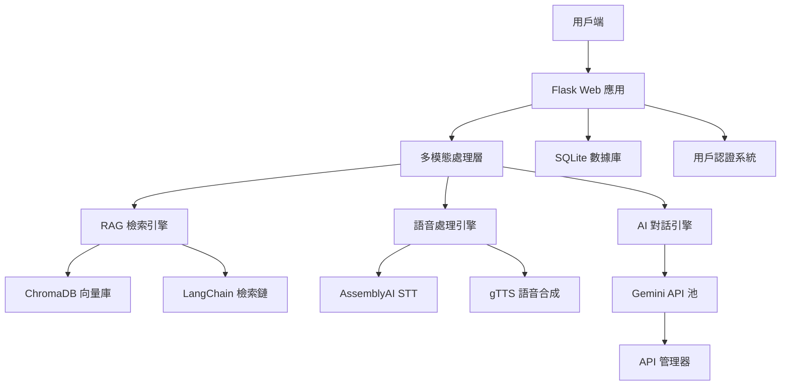

# AI 英文學習平台

[](https://python.org)
[](https://flask.palletsprojects.com)
[](https://langchain.com)
[](https://chromadb.ai)

一個整合了 RAG 技術與多模態互動的 AI 英語學習平台。

## 核心功能

### 1. RAG 教材問答系統
- **功能**：支援對上傳的 PDF/CSV/TXT 格式教材進行內容問答。
- **技術**：使用 LangChain 框架，結合 ChromaDB 向量資料庫進行檢索增強生成 (RAG)。

### 2. AI 口說練習
- **功能**：提供多主題、多輪對話的 AI 口說陪練，並提供發音、流暢度等多維度評分。
- **技術**：整合 AssemblyAI 進行語音識別，並由後端維護對話上下文。

### 3. API 金鑰管理
- **功能**：支援多組 API 金鑰的輪替使用與請求失敗時的自動切換。
- **目的**：提高系統的穩定性與請求成功率。

## 系統架構圖



## RAG 系統運作流程

1.  **索引階段 (Indexing)**:
    - **讀取與分割**: 使用 `build_vector_db.py` 腳本，透過 `Langchain` 的文件載入器讀取來源文件（如 PDF、CSV）。
    - **向量化**: 將分割後的文字區塊透過模型轉換成向量（Embeddings）。
    - **儲存**: 將向量及其原始文本存入 `ChromaDB` 向量資料庫。

2.  **查詢階段 (Querying)**:
    - **使用者提問**: 使用者在「教材練習」功能中提出問題。
    - **相似度搜尋**: 系統將問題轉換為向量，在 `ChromaDB` 中找出與問題最接近的文字區塊。
    - **增強生成**: 將檢索到的原文作為上下文，連同原始問題一起發送給大型語言模型（Gemini）。
    - **生成答案**: 模型根據上下文生成回答，並可選擇性地引述資料來源。

---

# 功能更新日誌

## 2025/09/26 - AI 單字本生成 & UI 優化

- **新增功能**: 在「自訂單字卡」頁面新增「AI 生成單字本」功能。
- **輸入方式**: 支援上傳檔案（.txt, .pdf）或直接貼上文字作為單字來源。
- **處理流程**: 後端 `rag_vocabulary_extractor.py` 會從文本中提取關鍵單字及其翻譯，並自動建立新的單字本。
- **UI 優化**: 操作介面採用彈出式視窗，並調整了部分版面配置。

## 2025/09/26 - 新增自訂單字卡功能

- **核心功能**: 允許使用者建立自己的單字本，並在其中新增、查看、翻轉和刪除單字卡。
- **AI 輔助**: 新增單字時若未提供翻譯，系統可呼叫 AI 自動翻譯。
- **獨立測驗**: 為每個自訂單字本提供獨立的測驗功能。
- **技術實現**: 建立了新的資料庫模型 (`CustomVocabularyBook`, `CustomQuiz...`) 及對應的 API 端點。

## 2025/09/25 - 口說練習功能更新

- **對話記憶**: AI 現在能夠記錄對話歷史，實現更連貫的上下文對話。
- **評估系統更新**: AI 評估引擎現在會提供針對**語法、詞彙、流暢度、相關性**的具體分數 (1-10分) 與文字回饋。
- **流程優化**: AI 在提供評價後會自動提出下一個問題，簡化了操作流程。
- **自訂主題**: 允許使用者輸入自訂的練習情境。

---

# 安裝與執行

## 安裝依賴

```bash
pip install -r requirements.txt
```

## API 金鑰設定

本專案需要 Gemini API 和 ngrok。請至其官網註冊並獲取 API 金鑰。

- Gemini: [https://aistudio.google.com/welcome](https://aistudio.google.com/welcome)
- ngrok: [https://ngrok.com/](https://ngrok.com/)

獲取金鑰後，請在 `api_manager.py` 或相關設定檔中替換您的金鑰。

## 資料庫設定

本專案使用 SQLite。首次執行前，請先初始化資料庫：

```bash
python3 database_setup.py
```

此指令會建立 `learning_platform.db` 檔案及所需資料表。

## 啟動應用

```bash
# 進入 venv 環境 (macOS/Linux)
source venv/bin/activate

# 啟動 Flask 應用
python app.py
```

啟動成功後，終端機會顯示一個公開的 ngrok URL，點擊即可訪問。

# 管理員後台

1.  **登入**: 訪問 `/login`，使用預設帳號登入：
    *   **使用者名稱**: `admin`
    *   **密碼**: `admin`
2.  **訪問**: 登入後將自動導向 `/admin/dashboard`，可查看系統統計數據。
