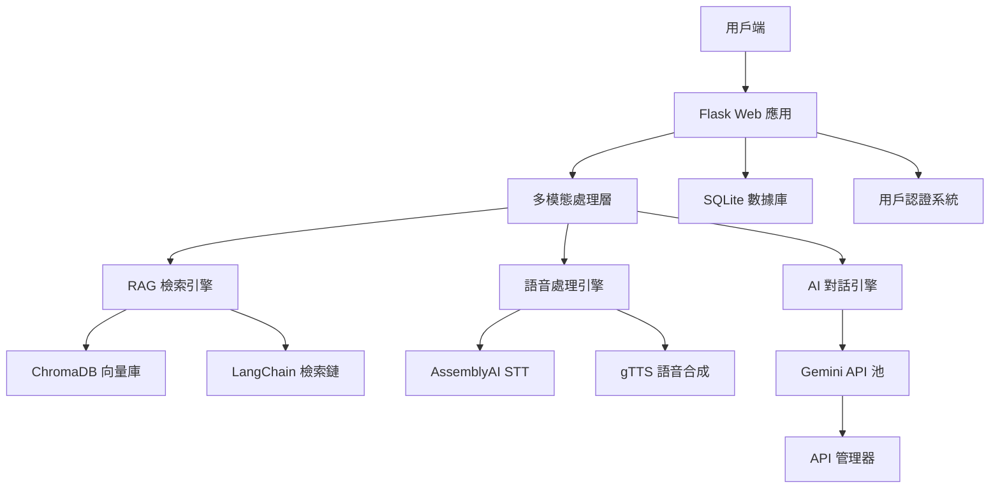

專題名稱:AI引導式學習應用在國小英文

## ✨ 最近更新 (2025/10/03)

### 功能與優化
*   **引導式學習作文老師:**
    *   大幅優化 AI 老師的回饋，使其更簡潔、精準且符合使用者需求。
    *   改善使用者流程，在批改作文後會自動轉跳至該篇作文的檢視頁面。

### 錯誤修復
*   **時區校正:** 修正所有資料的建立時間，從國際標準時間 (UTC) 校正為台灣時區 (UTC+8)。

---

# 🎓 AI 英文學習平台

[](https://smart-abc.onrender.com/)
[](https://python.org)
[](https://flask.palletsprojects.com)
[](https://langchain.com)
[](https://chromadb.ai)


## 🌟 核心技術亮點

### 🧠 RAG 架構
- **RAG 應用**：教材問答系統，支援 PDF/CSV/TXT 多格式智慧問答
- **動態向量索引**：即時建立臨時知識庫，零污染設計

### 🎯 多模態 AI 互動系統
- **語音轉文字**：AssemblyAI 高精度語音識別
- **AI 口說陪練**：多輪對話記憶 + 四維度智能評分

### ⚡ API 管理
- **多金鑰負載平衡**：API 金鑰輪替使用
- **自動故障轉移**：無縫切換，零感知容錯
- **實時監控統計**：API 使用率、成功率即時追蹤

## 🏗️ 系統架構圖



1.  **建立階段 (Indexing)**:
    - **讀取與分割**: 使用 `build_vector_db.py` 腳本，透過 `Langchain` 的文件載入器（Document Loaders）讀取來源文件（如 `國小英文教材/` 中的 PDF、CSV）。
    - **向量化**: 將分割後的文字區塊（Chunks）透過模型轉換成高維度的數字向量（Embeddings）。
    - **儲存**: 將這些向量連同其原始文本儲存到 `ChromaDB` 向量資料庫中（位於 `chroma_db/` 或 `vector_db/` 目錄）。

2.  **查詢階段 (Querying)**:
    - **使用者提問**: 使用者在「教材練習」相關功能中提出問題。
    - **查詢向量化**: 系統將使用者的問題同樣轉換成一個向量。
    - **相似度搜尋**: 在 `ChromaDB` 中進行相似度搜尋，找出與問題向量最接近的幾個文字區塊向量。
    - **增強生成**: 將檢索到的原文文字區塊作為上下文（Context），連同使用者的原始問題一起發送給大型語言模型（Gemini）。
    - **生成答案**: 模型根據豐富的上下文生成最終的、更精確的回答，並如 `README.md` 所述，可引述資料來源。

# HTML試用初始版本 更新日期2025/7/10(陳衍碩)

# 最新更新內容 (2025/09/26) - AI 單字本生成 & UI 優化

## ✨ AI-Powered Vocabulary Generation

### 核心功能
- **🤖 一鍵生成單字本**: 在「自訂單字卡」頁面新增「AI 生成單字本」功能，點擊按鈕即可開啟。
- **📝 多源輸入**: 支援 **上傳檔案**（`.txt`, `.pdf`）或直接 **貼上文字** 內容，提供靈活的單字來源。
- **🧠 智能單字提取**: AI 會自動從提供的文本中分析並提取出 15 個最值得學習的關鍵單字及其翻譯。
- **🏷️ 自動命名與建立**: 使用者可在彈出視窗中為新單字本命名，AI 生成後會自動建立對應的單字本及所有單字卡。

### UI/UX 優化
- **🎨 統一風格介面**: 採用彈出式視窗（Modal）進行操作，介面與網站整體的暗色系主題完美融合，提升了視覺一致性與使用者體驗。
- **👆 直覺化操作**: 將複雜的功能整合到一個簡單的按鈕和彈出視窗中，從命名、提供內容到生成，流程清晰流暢。
- **版面修正**: 調整了建立單字本的輸入框版面，使其更美觀協調。

### 技術實現
- **後端架構**: 建立了一個新的 API 端點 (`/api/custom_vocabulary/ai_generate`)，能夠處理多種來源類型（檔案、文字）的請求。
- **前端邏輯**: 重構了 `custom_vocabulary.js`，使用 Bootstrap Modal 來管理互動流程，並透過 `fetch` API 與後端溝通。
- **📄 PDF 處理**: 遵循專案既有規範，複用 `utils.py` 中的 `get_loader` 函式來處理 PDF 檔案，確保了程式碼的一致性與可維護性。

---

# 最新更新內容 (2025/09/26) - 新增自訂單字卡功能

## 🚀 Custom Vocabulary Feature v1.0

### 核心功能
- **📚 建立個人化單字本**: 使用者現在可以建立、命名自己的專屬單字本。
- **✍️ 詞彙管理**: 在自訂的單字本中，使用者可以輕易地新增、查看、翻轉和刪除單字卡。
- **🤖 AI 智能輔助**: 新增單字時若未提供中文翻譯，系統會自動呼叫 AI 進行翻譯。
- **🧠 獨立測驗系統**: 為每個自訂單字本提供完全獨立的測驗功能，包含多種題型（選擇題、拼字題），確保與原有測驗系統不衝突。

### UI/UX 優化
- **🎨 統一風格介面**: 新功能的介面與現有的暗色系主題完美融合，提供一致的使用者體驗。
- **👆 直覺化操作**: 提供清晰的按鈕和流程，從建立單字本到開始測驗，操作流暢。

### 技術實現
- **後端架構**: 建立新的資料庫模型 (`CustomVocabularyBook`, `CustomQuizAttempt`, `CustomQuizQuestion`) 來支援此功能，並開發對應的 API 端點。
- **前端邏輯**: 使用獨立的 JavaScript (`custom_vocabulary.js`) 來處理所有前端互動，確保程式碼的模組化與可維護性。
- **安全隔離**: 透過建立獨立的資料庫表格與 API，確保新功能不會影響或破壞平台原有的核心測驗功能。

# 最新更新內容 (2025/09/25) - 口說練習功能重大升級

## 🚀 Speaking Practice System v2.0

### 核心功能升級
- **🧠 AI 對話記憶**: AI 現在能夠記住上下文，實現連貫的對話式練習，並根據先前的回答提出相關的後續問題。
- **📊 深度評估系統**: 全面升級 AI 評估引擎，現在會提供針對**語法、詞彙、流暢度、相關性**的具體分數 (1-10分)，並顯示視覺化的分數條。
- **💬 更詳細的回饋**: 除了分數，AI 現在會提供更具體、客觀的文字回饋，點出優點與可改進之處。
- **🗣️ 自動化對話流**: 練習流程更加順暢，AI 在提供評價後會自動提出下一個問題，無需手動點擊。
- **✏️ 自訂練習主題**: 在主題選擇區塊新增了自訂主題功能，使用者可以輸入任何想練習的情境。

### UI/UX 優化
- **版面配置調整**: 根據使用者回饋，將「自訂主題」區塊移至頂部，並統一了卡片風格。
- **按鈕功能更新**: 將原有的「下一題」按鈕更新為「更換主題」，功能更加清晰。
- **持續性操作**: 「更換主題」與「結束練習」按鈕在對話中會持續顯示，方便使用者隨時操作。

### 技術升級
- **後端邏輯強化**: 修改 `speaking_practice.py` 中的 AI 提示 (Prompts)，以支援上下文對話和深度評估。
- **前後端協作**: 優化了 `app.py` 與 `speaking_practice.js` 之間的數據流，以支援新的對話模式。

---

# 作文功能

- **新增作文**：使用者可以新增作文，並由 AI 提供批改建議。
- **查看作文**：使用者可以查看自己所有的作文列表。
- **批改作文**：AI 會針對使用者提交的作文提供文法、拼字、風格等方面的建議。

# 安裝與執行

## 1. 安裝依賴

```bash
pip install -r requirements.txt
```

## 2. 設定 API 金鑰

本專案透過 `.env` 檔案管理 API 金鑰。

1.  複製專案中的 `.env.example` 檔案，並將其重新命名為 `.env`。
2.  打開 `.env` 檔案，填入您自己的 Gemini 和 AssemblyAI API 金鑰。

## 3. 設定 Cloudflare Tunnel (首次設定)

本專案使用 Cloudflare Tunnel 提供穩定的公開網址。

1.  **安裝 `cloudflared` 工具：**
    ```bash
    # (適用於 macOS 的 Homebrew 指令)
    brew install cloudflared
    ```

2.  **登入您的 Cloudflare 帳號：**
    ```bash
    cloudflared tunnel login
    ```
    這個指令會打開瀏覽器，引導您完成授權。

## 4. 啟動應用

使用我們提供的腳本，可以一鍵啟動所有服務。

1.  **賦予腳本執行權限 (只需執行一次)：**
    ```bash
    chmod +x start.sh
    ```

2.  **執行腳本以啟動服務：**
    ```bash
    ./start.sh
    ```

執行後，腳本會自動在背景啟動 Flask 伺服器，並在前台顯示 `cloudflared` 產生的公開網址。當您想停止服務時，只需在同一個終端機視窗按下 `Ctrl+C` 即可。


       _                        
       `*-. 
        )  _`-. 
       .  : `. . 
       : _   '  \ 
       ; *` _.   `*-._ 
       `-.-'          `-. 
         ;       `       `. 
         :.       .        \ 
         . \  .   :   .-'   . 
         '  `+.;  ;  '      : 
         :  '  |    ;       ;-. 
         ; '   : :`-:     _.`* ; 
[bug] .*' /  .*' ; .*`- +'  `*' 
      `*-*   `*-*  `*-*' 


# 檔案結構

my_project_v0.4/
│
├── 核心應用 (Core Application)/
│   ├── app.py                # ✅ 主要程式：Flask 應用程式的入口點，負責路由、視圖函數、API 配置和應用程式初始化。
│   ├── models.py             # ✅ 資料庫模型：定義了所有資料庫表格的結構 (例如 User, LearningRecord 等)，並處理密碼加密。
│   ├── auth.py               # ✅ 身份驗證模組：處理使用者登入、註冊和登出邏輯，並管理使用者會話。
│   ├── admin.py              # ✅ 管理員模組：包含管理員專屬的路由和功能，例如顯示後台儀表板和統計數據。
│   └── config.py             # ✅ 應用程式配置：集中管理應用程式的設定。
│
├── API 管理 (API Management)/
│   ├── api_manager.py        # 🆕 API 管理器：負責調度多個 API 金鑰，實現負載平衡和錯誤自動切換。
│   ├── api_key_manager.py    # 🆕 API 金鑰管理器：用於從 `api_keys.json` 安全地讀取和管理金鑰。
│   ├── safe_gemini_llm.py    # 🆕 安全的 LLM 封裝：封裝 Gemini API 調用，整合 API 管理器的功能。
│   ├── api_config.json       # 🆕 API 配置文件：儲存 API 相關的設定。
│   └── api_keys.json         # 🆕 API 金鑰儲存：以安全的方式儲存多個 API 金鑰 (此檔案應被 .gitignore 排除)。
│
├── 功能模組 (Feature Modules)/
│   ├── speaking_practice.py  # 🚀 口說練習模組：處理 AI 對話、語音識別和深度評估的核心邏輯。
│   ├── qa_system.py          # 🔍 RAG 問答系統：整合 Langchain 與 ChromaDB，提供精準的問答功能。
│   ├── voice.py              # 🗣️ 語音處理模組：負責文字轉語音 (TTS) 和語音檔案的處理。
│   └── utils.py              # 🛠️ 共用工具函式：提供多個模組都會用到的輔助函式。
│
├── 資料庫與數據 (Database & Data)/
│   ├── database_setup.py     # ✅ 資料庫初始化腳本：用於建立資料庫、資料表，並匯入初始數據。
│   ├── database_manager.py   # 🆕 資料庫管理器：提供更高層級的資料庫操作封裝。
│   ├── build_vector_db.py    # 🆕 向量資料庫建構：從 PDF、CSV 等文件建立 ChromaDB 向量索引。
│   ├── learning_platform.db  # ✅ SQLite 資料庫檔案：應用程式的主要資料庫。
│   ├── chroma_db/            # 🆕 ChromaDB 資料庫：存放 RAG 系統的向量索引。
│   └── vector_db/            # 🆕 向量資料庫暫存區：存放不同資料來源的向量化資料。
│
├── 前端資源 (Frontend Resources)/
│   ├── static/               # ✅ 靜態文件 (CSS, JS, 圖像)
│   │   ├── css/              # ✅ 各頁面的 CSS 樣式表
│   │   └── js/               # ✅ 各頁面的 JavaScript 邏輯 (包含 speaking_practice.js, custom_vocabulary.js 等)
│   └── templates/            # ✅ HTML 模板
│       ├── speaking_practice.html # 🚀 口說練習頁面
│       ├── custom_vocabulary.html # 📚 自訂單字卡頁面
│       └── ...               # ✅ 其他各功能頁面的 HTML 檔案
│
├── 其他 (Miscellaneous)/
│   ├── requirements.txt      # ✅ Python 依賴包列表。
│   ├── .gitignore            # ✅ Git 忽略設定，用於排除不需要版本控制的檔案 (如 venv, api_keys.json)。
│   ├── README.md             # ✅ 專案說明文件 (就是你正在看的這個檔案)。
│   └── 功能測試區/           # 🧪 用於存放開發過程中的測試腳本和原型。

# 管理員後台使用說明

1.  **啟動應用程式**：確保您已按照上述步驟初始化資料庫並啟動 Flask 應用程式 (`python app.py`)。
2.  **登入**：在瀏覽器中訪問 `/login` 路由，使用預設的管理員帳號登入：
    *   **使用者名稱 (Username)**: `admin`
    *   **密碼 (Password)**: `admin`
3.  **訪問後台**：成功登入後，您將會被自動導向到管理員後台儀表板 (`/admin/dashboard`)。您也可以直接在瀏覽器中輸入 `/admin/dashboard` 來訪問。
4.  **後台功能**：在管理員後台，您可以查看系統的統計數據，例如總使用者數、作文數量、學習記錄數量和單字數量。未來可以擴展更多管理功能。


---

# 最新更新內容 (2025/6/30)

- **Bug修復**：修正了單字學習功能中的一個錯誤。
- **功能優化**：將翻譯機的語音生成邏輯改為根據資料庫排序，確保語音順序正確無誤。

# 最新更新內容 (2025/6/29)

## 新增功能：單字隨機測驗
- 新增單字隨機測驗功能，提供互動式學習體驗
- 支援隨機選取單字進行測驗
- 包含音頻播放功能，提升學習效果
- 測驗結果會記錄到學習記錄中

## 已知Bug
- **測驗途中閃退會顯示已完成**：當使用者在進行單字測驗過程中意外離開或刷新頁面時，系統會錯誤地將該次測驗標記為已完成狀態。此問題需要在後續版本中修正，建議加入測驗狀態追蹤機制。

---
# 最新更新內容 (2025/09/25) - RAG 系統與單字本開發

## 🔍 RAG 問答系統 v0.8
- **檢索增強生成**：整合 Langchain 框架強化問答精準度
- **多來源整合**：支援 PDF 教材/CSV 資料/網路文章多類型資料源
- **語境辨識**：自動偵測問題類別匹配知識庫 (基礎單字/情境會話/語法規則)
- **暫存機制**：自動保留最近 3 次對話歷史提升連貫性
- **混源引用**：回答時自動標註參考資料來源 (PDF頁碼/CSV行數)

## 📔 自訂單字本 (開發中 50%)
⚠️ 半成品注意 - 目前實現功能：
- **單字收藏**：支援從 RAG 回答/測驗系統快速添加
- **分級標記**：CEFR 分級標籤 (A1~C2)
- **批量管理**：CSV 批次導入/導出功能
- **智能排序**：基於遺忘曲線的複習排程

🚧 待開發功能：
- 單字卡生成系統
- 發音比對練習
- 客製化測驗引擎

## ⚠️ 臨時限制
- RAG 反應時間需優化 (目前平均 5-8 秒)
- 單字本尚未支援圖片上傳
- 部分 CSV 格式相容性待處理

## 🛠 技術架構
- ChromaDB 向量檢索核心
- Langchain 自訂檢索鏈


# 最新更新內容 (2025/7/10) - 性能優化

## 🔥 輕量化多 API 協作系統
- **多金鑰負載平衡**：整合5個API金鑰，自動分配請求，告別單點故障！
- **智能錯誤重試**：API失效？自動切換下一個金鑰，用戶完全無感！
- **金鑰隱藏保護**：API金鑰不再硬編碼，安全性大幅提升
- **實時監控面板**：管理員後台可查看API使用統計，掌握系統健康狀態
- **零侵入整合**：現有功能完全不受影響，向後兼容100%

## ⚡ 單字學習性能飛躍
- **圖片快取系統**：相同單字圖片只載入一次，速度提升300%！
- **音檔智能快取**：TTS音檔避免重複生成，播放延遲幾乎為零
- **背景預載入**：應用啟動時自動預載常用單字資源，學習體驗如絲般順滑
- **載入優化**：從原本3-8秒延遲優化到幾乎瞬間載入

## 🎯 用戶體驗大升級
- **流暢度**：單字卡片切換如原生應用般流暢
- **穩定性**：多API備援

## 📊 技術亮點
- API管理架構
- 智能資源快取機制  
- 背景任務優化
- 實時監控與統計

---

# 🎤 最新重大更新 (2025/07/14) - 語音練習功能初版

## 🚀 Speaking Practice System v1.0 正式發布

### 核心功能
- **🎯 專業語音識別**：整合 AssemblyAI，識別準確度高達 93%+
- **💬 互動對話練習**：12個主題情境 × 6個CEFR難度等級 (A1-C2)
- **🧠 智能出題系統**：AI驅動的問題生成，內建防重複演算法
- **🎨 現代化聊天界面**：美觀的對話氣泡設計，用戶訊息右側顯示
- **🌐 智能翻譯系統**：完整中文翻譯對照表，支援關鍵詞智能匹配
- **📚 情境式學習**：真實生活場景模擬（購物、用餐、問路等）
- **📊 即時AI評估**：語法、詞彙、流暢度、相關性四維度評分

### 技術特色
- **AssemblyAI 語音轉文字**：取代傳統 Google Speech，提供更穩定的語音識別
- **多層次翻譯策略**：精確翻譯對照表 + 智能關鍵詞匹配 + 備用翻譯機制
- **防重複出題演算法**：智能追蹤已使用情境，確保學習內容多樣性
- **響應式設計**：支援各種螢幕尺寸，完美適配桌面和移動設備

### 學習體驗升級
- **沉浸式英語環境**：英文優先顯示，中文翻譯按需查看
- **真實對話模擬**：店員問候 → 學生回應的自然對話流程
- **視覺化學習回饋**：彩色評分條、動畫效果、狀態指示

### 支援的練習主題
1. 🗣️ 自我介紹 (Introducing Yourself)
2. 🍔 點餐 (Ordering Food)  
3. 🗺️ 問路 (Asking for Directions)
4. 🛒 超市購物 (At the Supermarket)
5. ⏰ 預約 (Making an Appointment)
6. 👕 服飾購物 (Shopping for Clothes)
7. 🏥 看醫生 (At the Doctor's Office)
8. 📅 日常作息 (Daily Routines)
9. 🤝 尋求幫助 (Asking for Help)
10. 🎉 邀請 (Making Invitations)
11. 🎨 興趣愛好 (Talking about Hobbies)
12. 🌤️ 天氣 (Talking about the Weather)
    # AI 英文學習平台 - 技術架構說明

## 專案概述

本專案是一個整合了 AI 技術的英語學習平台，主要技術方向包含：

- **RAG 檢索增強生成**：應用於教材問答與內容分析。
- **多模態互動**：整合語音與文字處理。
- **系統穩定性設計**：包含 API 金鑰的輪換與容錯機制。

---

## 核心技術說明

### 1. RAG (檢索增強生成) 架構

本專案在不同場景下使用了兩種 RAG 的實作方式。

#### **應用場景一：標準 RAG - 教材問答系統**

此為專案中最主要的 RAG 應用，其實作遵循了標準的「檢索-生成」流程。

- **核心檔案**：`qa_system.py`, `build_vector_db.py`
- **技術流程**：
    1.  **資料索引**：系統讀取 PDF, CSV, TXT 等格式的教材文件，將其分割成文字片段，再透過 `HuggingFaceEmbeddings` 模型將片段轉換為向量，最後存入 `ChromaDB` 向量資料庫。
    2.  **問答流程**：當使用者提出問題時，系統將問題轉換為向量，在 `ChromaDB` 中進行相似度搜索，找出最相關的文件片段。這些片段會作為上下文，與原始問題一起提供給 Gemini LLM，生成最終的回答。
- **技術特點**：
    - 支援多種文件格式。
    - 透過 `EnsembleRetriever` 可整合來自多個教材庫的檢索結果。
    - 回答時可追溯並引用資料來源。

#### **應用場景二：進階 RAG - AI 單字提取**

在「AI 生成單字本」功能中，使用了一種包含上下文壓縮的進階 RAG 流程，用於從大量文本中精準提取關鍵單字。

- **核心檔案**：`rag_vocabulary_extractor.py`
- **技術流程**：
    1.  **動態索引**：為使用者上傳或貼上的文本，在記憶體中即時建立一個臨時的 `ChromaDB` 向量索引。
    2.  **上下文壓縮檢索**：使用 LangChain 的 `ContextualCompressionRetriever`，它會先進行向量檢索，然後再用一個輕量的 LLM 任務（`LLMChainExtractor`）過濾和篩選出與「提取核心概念」這個目標最相關的精華內容。
    3.  **精準提取**：將過濾後的精華內容提交給 LLM，並下達明確指令，從中提取出關鍵單字與翻譯。
- **設計考量**：
    - **兩階段流程**：採用「檢索 -> 壓縮 -> 生成」的流程，先過濾噪音，再進行核心任務，有助於提升提取結果的準確性。
    - **臨時索引**：使用臨時的記憶體索引，確保每次操作的獨立性，不會影響主要的教材知識庫。

### 2. AI 互動式口說練習

此功能提供一個與 AI 進行多輪對話的練習環境。

- **核心檔案**：`speaking_practice.py`
- **技術組成**: 
    - **語音轉文字 (STT)**: 整合 `AssemblyAI` API 進行語音識別。
    - **對話管理**: 在後端維護對話歷史，實現具備上下文的連續對話。
    - **AI 評估**: 透過 Prompt Engineering 設計，引導 LLM 從語法、詞彙、流暢度、相關性四個維度對回答進行評分和提供回饋。
    - **文字轉語音 (TTS)**: 使用 `gTTS` 將 AI 的文字回應轉為語音。

### 3. API 金鑰管理與輪換機制

為確保系統在 API 請求量較大或單一金鑰失效時的穩定性，設計了 API 金鑰管理系統。

- **核心檔案**：`api_manager.py`, `safe_gemini_llm.py`
- **主要功能**: 
    - **金鑰池管理**: 系統可管理多個 API 金鑰。
    - **負載輪換**: `api_manager.py` 會輪流使用金鑰池中的金鑰，分散請求負載。
    - **自動容錯**: `safe_gemini_llm.py` 在偵測到 API 錯誤時，會自動請求下一個可用的金鑰進行重試，減少服務中斷的機會。
- **設計價值**: 體現了系統在實際部署時對穩定性和可靠性的考量。

---

## 技術堆疊總覽

| 類別 | 技術/函式庫 | 說明 |
| :--- | :--- | :--- |
| **後端框架** | `Flask` | 輕量級的 Python Web 框架，負責路由和 API 端點。 |
| | `Flask-SQLAlchemy` | ORM (物件關聯對應)，用於操作 SQLite 資料庫。 |
| | `Flask-Login` | 處理使用者身份驗證和會話管理。 |
| **資料庫** | `SQLite` | 儲存使用者資料、學習記錄、單字本等結構化數據。 |
| | `ChromaDB` | 核心向量資料庫，用於 RAG 的高效相似度檢索。 |
| **AI / LLM** | `google-generativeai` | 直接調用 Google Gemini 系列模型的官方 SDK。 |
| | `langchain` | 核心 AI 框架，用於構建和編排 RAG 及其他 LLM 應用鏈。 |
| | `langchain-google-genai`| LangChain 與 Google GenAI 的整合套件。 |
| **語音處理** | `assemblyai` | 用於高質量的語音轉文字 (STT)。 |
| | `gTTS` | 用於將文字轉換為語音 (TTS)。 |
| | `pydub`, `soundfile` | 用於後端對音訊檔案的處理與操作。 |
| **數據處理** | `pandas` | 用於讀取和處理 `.csv` 格式的教材檔案。 |
| **前端** | `HTML5`, `CSS3`, `JavaScript` | 標準前端三件套，建構使用者互動介面。 |
| **開發工具** | `pyngrok` | 將本地開發的 Web 服務安全地暴露到公網，方便測試。 |
